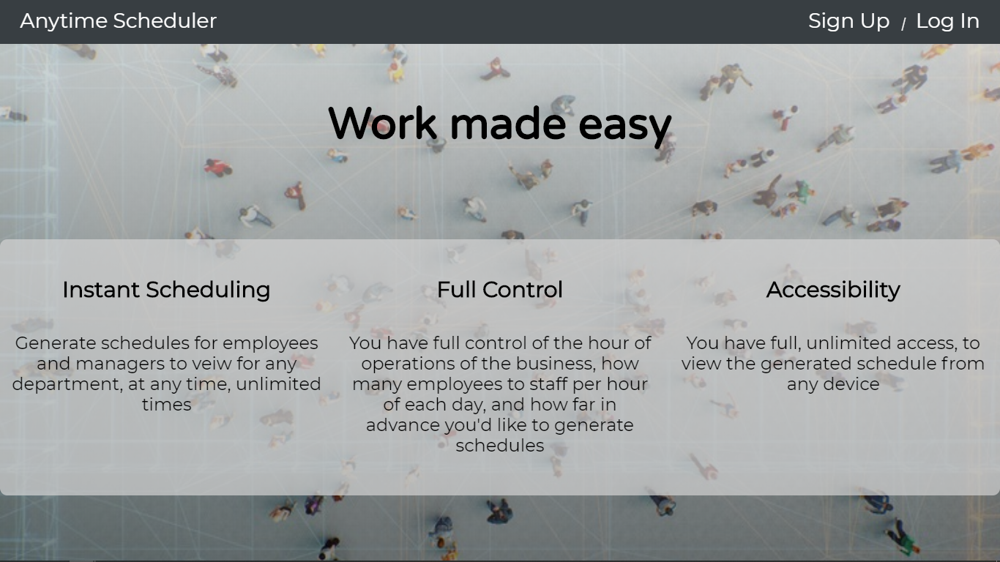
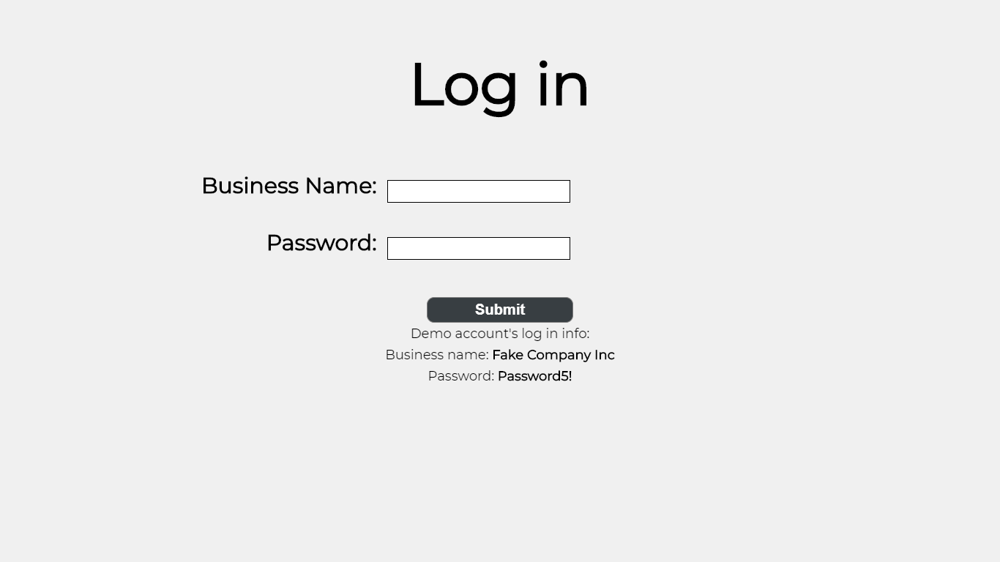
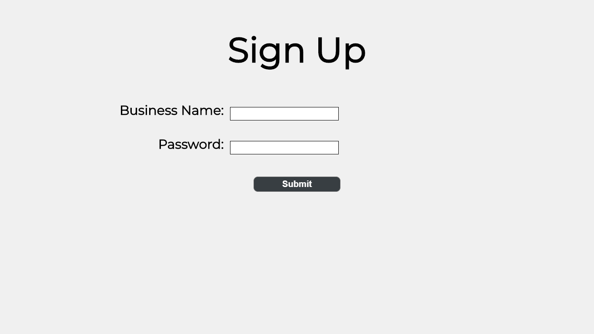

# Anytime Scheduler Client

Live Site: [Anytime Scheduler](https://anytime-scheduler-client.now.sh/)

1. **This is the landing page, provides a description of the app and an option to login or signup**

2. **Login Page for returning users, also showing the demo accounts user login info**

3. **Signup account for new users to create an account**

## Technologies Used
Created and bootstrapped with create-react-app. This app uses HTML/CSS/React JavaScript to present a complete client side application.
The backend/database uses Node/Exress/PostrgreSQL that is tested by mocha/chai, which you can find here: https://github.com/ezg97/Anytime-Scheduler-Server
